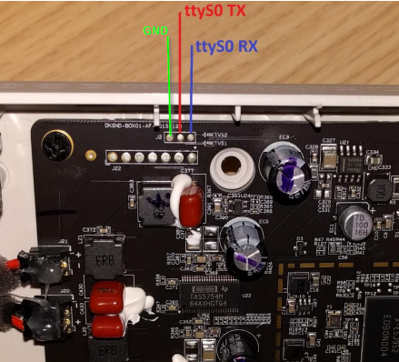

# Préparation
1) télécharger l'image 
  [system-1.4.0.img.zip](../../raw/main/Firmware/system-1.4.0.img.zip)
  [system-1.9.112.zip](../../raw/main/Firmware/system-1.9.112.zip)

2) Mettre le fichier IMG dans une clé usb au format fat32
3) brancher / souder votre ftdi232 en 3v3 ou autre usb serial sur les pins comme sur la photo.
 

1) Avec Putty mettez vous en serial COM X (selon votre pc) vitesse 115200

2) Allumer l'enceinte et regarder la console dans putty.

**Créer une sauvegarde.** (Toutes les procédures ci-dessous sont effectuées via le port console!)

# Sauvegarde de votre partition:
1. Démarrez en mode sécurité
Lorsque vous voyez au démarrage du système:
```
Appuyez sur la touche [f] et appuyez sur [ENTER] pour passer en mode sécurité intégrée
Appuyez sur la [1], [2], [3] ou [4] et appuyez sur [Entrée] pour sélectionner le niveau de débogage<
```
Appuyez sur f et entrez. Le système démarrera en mode sans échec.


2. vérifiez si l'appareil est apparu:

```
ls /dev/sd*
```
La sortie de la commande doit contenir sda et sda1
Si le périphérique n'apparaît pas, exécutez les commandes:
```
mknod /dev/sda b 8 0
mknod /dev/sda1 b 8 1
```

3. Montez la clé USB:
```
mkdir /tmp/flash
mount /dev/sda1 /tmp/flash
```

4. Ensuite, nous regardons la division à partir de laquelle le système est chargé, exécutons la commande:
```
ubootenv
```

*Soit mmcblk0p7 ou mmcblk0p10*

5. Faites une sauvegarde sur une clé USB ( */ dev / mmcblk0p7* - le nom de la section du paragraphe précédent):
```
dd if=/dev/mmcblk0p7 of=/tmp/flash/system.img
```

6. Ensuite, démontez la clé USB:
```
umount /dev/sda1
```

7. Maintenant, nous vérifions sur l'ordinateur le fichier system.img sur la clé USB (c'est notre sauvegarde).

**La restauration à partir d'une sauvegarde est similaire à la création d'une sauvegarde, à l'exception du point 5:**

5. Restauration du système à partir d'une sauvegarde: Prendre le fichier télécharger plus haut system.img
```
dd if=/tmp/flash/system.img of=/dev/mmcblk0p7

reboot
```

# Configuration de l'enceinte
Pour la 1.4 installer l apk MI SPEAKER 1.3.2 pour configurer le wifi.

Pour la 1.9 installer l apk MI Home pour configurer le wifi.
